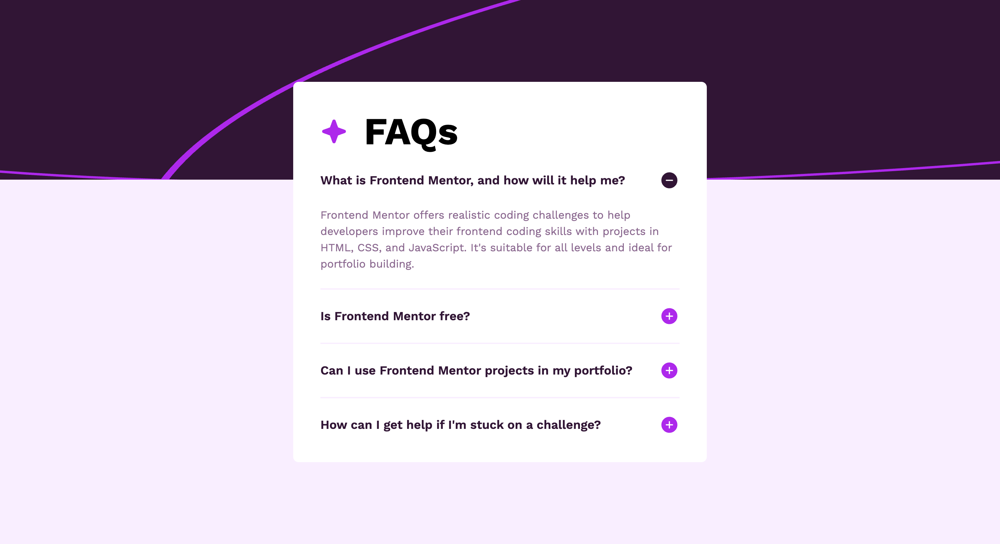

# Frontend Mentor Challenge

This is my solution to the [FAQ accordion challenge on Frontend Mentor](https://www.frontendmentor.io/challenges/faq-accordion-wyfFdeBwBz).

## Table of contents

- [Overview](#overview)
  - [The challenge](#the-challenge)
  - [Screenshot](#screenshot)
  - [Links](#links)
- [My process](#my-process)
  - [Built with](#built-with)
  - [Continued development](#continued-development)
- [Author](#author)

## Overview

### The challenge

Users should be able to:

- Hide/Show the answer to a question when the question is clicked
- Navigate the questions and hide/show answers using keyboard navigation alone
- View the optimal layout for the interface depending on their device's screen size
- See hover and focus states for all interactive elements on the page

### Screenshot

### Links

- [Source Code](https://github.com/irfanoezen/faq-accordion)
- [Live Preview](https://irfanoezen.github.io/faq-accordion/)

## My process

### Built with

- Semantic HTML5 markup
- CSS custom properties
- Flexbox
- CSS Grid
- Mobile-first workflow
- Vanilla JS

### Continued development

I want to focus more on my Javascript skills and responsive design as well as responsive behavior.

## Author

- Frontend Mentor - [@irfanoezen](https://www.frontendmentor.io/profile/irfanoezen)
- GitHub - [@irfanoezen](https://github.com/irfanoezen)
